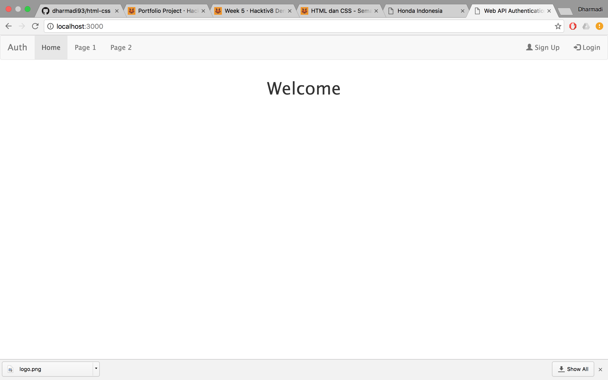
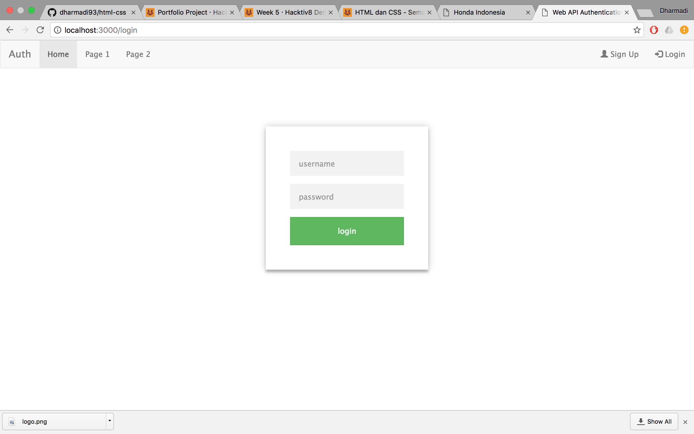
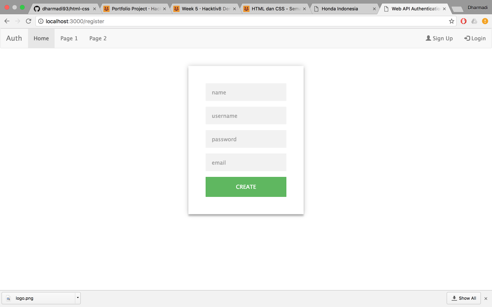
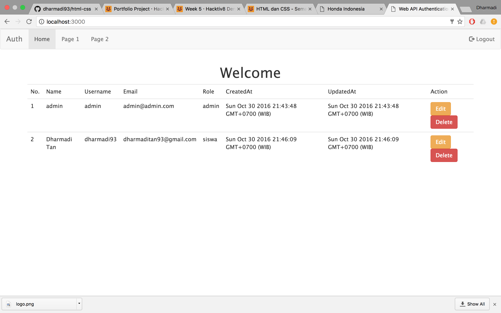
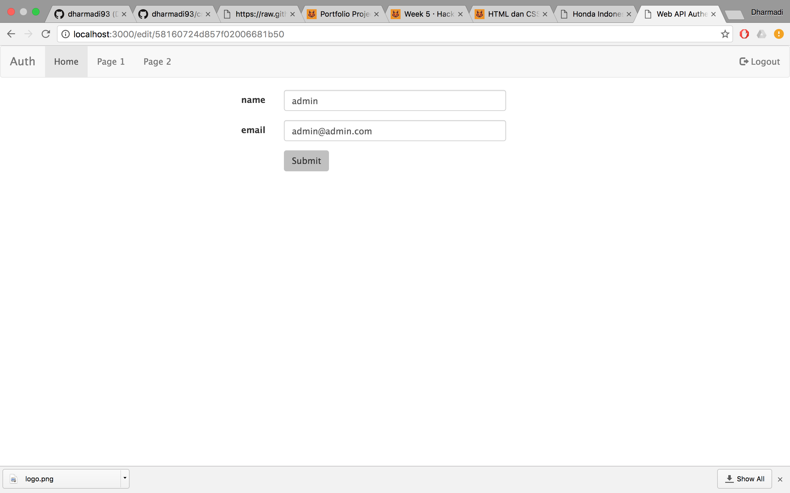
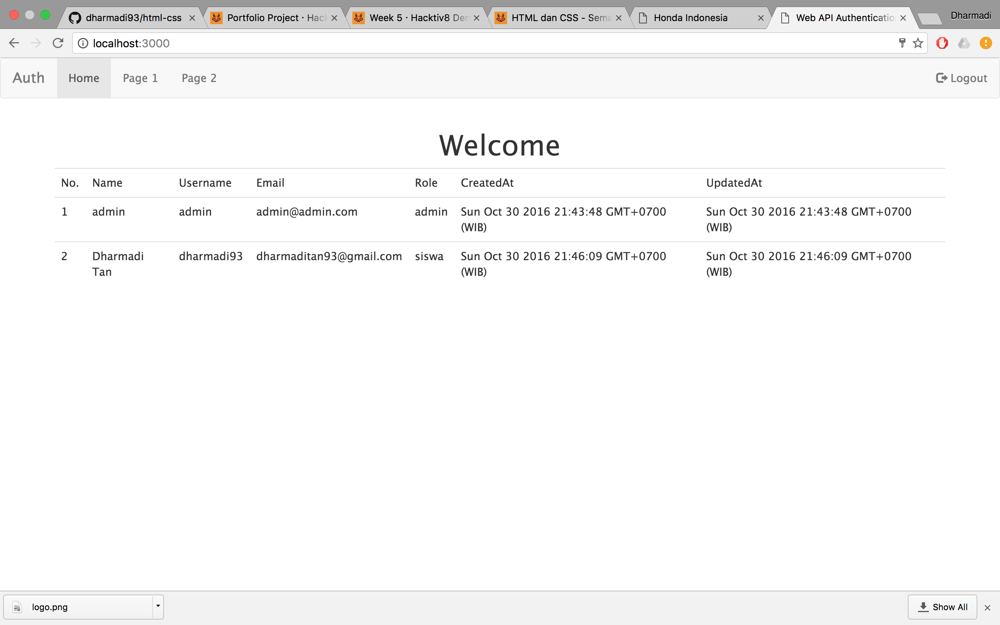

# Web API Authentication and Authorization

## Install Express

```
npm install express-generator -g
express --ejs
npm install
```

## Install Mongo DB

```
npm isntall mongodb --save
```

## Install Mongoose

```
npm install mongoose --save
```

## Install Express Session

```
npm install express-session
```

## Install Passport

```
npm install passport --save
```

## Install Passport Local

```
npm install passport-local --save
```

## Install Passport Local Mongoose

```
npm install passport-local-mongoose --save
```

## Screenshot

### Home

Tampilan utama tidak login



### Login

Tampilan login



### Register

Tampilan register



### Admin Home

Tampilan utama login admin



### Admin Edit

Tampilan edit untuk admin



### Sisw Home

Tampilan Utama login siswa



